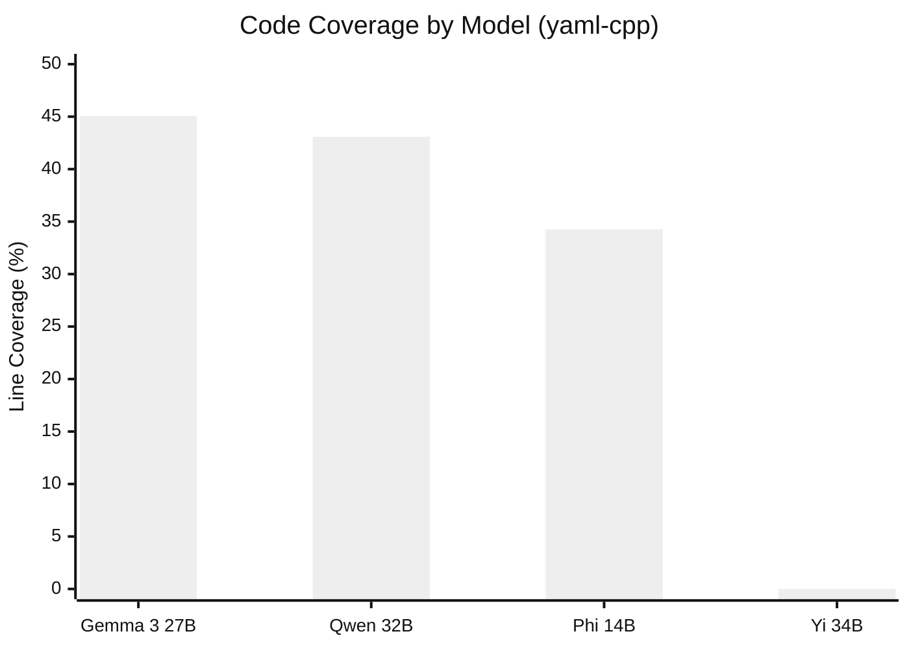
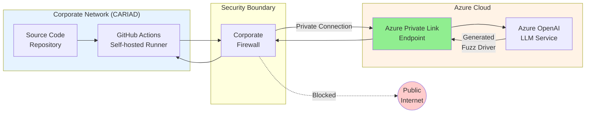
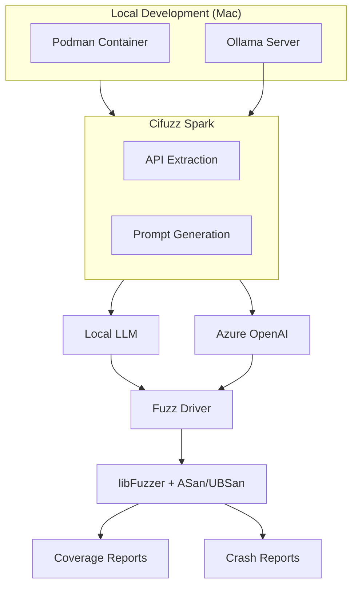
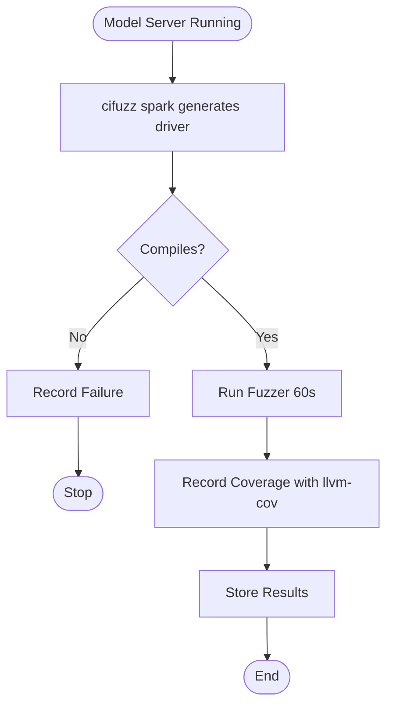
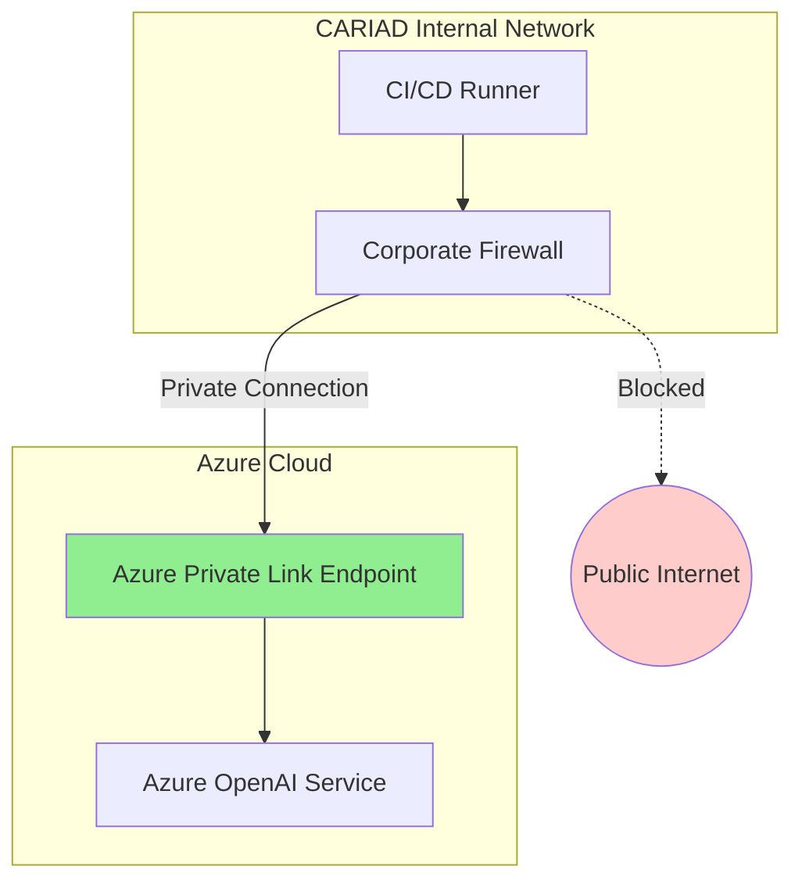

# Diagram Review - Academic Standards Assessment

**Date:** February 15, 2026  
**Reviewer:** Academic Standards Verification  
**Purpose:** Evaluate all thesis diagrams for professor acceptance and academic compliance

---

## EXECUTIVE SUMMARY

**Overall Status:** ⚠️ **NEEDS IMPROVEMENT**

Your diagrams have significant issues that may not meet academic standards:
- 3 figures are **text placeholders only** (not actual diagrams)
- Figures lack proper academic formatting
- No in-text references to figures
- Missing figure numbers in some locations

**Recommendation:** Create actual diagrams and improve formatting before submission.

---

## DETAILED DIAGRAM INVENTORY

### Chapter 4: Implementation (3 Figures)

#### ❌ Figure 4.1: Toolchain Architecture
**Location:** Line 79  
**Status:** TEXT PLACEHOLDER ONLY

**Current Format:**
```
**[Figure 4.1: Toolchain architecture diagram showing the relationships 
between components. Local Development (Mac with Podman, Ollama) connects 
to Cifuzz Spark, which connects to either Local LLM or Azure OpenAI. 
Output flows to libFuzzer with ASan/UBSan, producing Coverage Reports 
and Crash Reports.]**
```

**Issues:**
- ❌ No actual diagram present
- ❌ Just descriptive text in brackets
- ❌ Not referenced in surrounding text
- ❌ Will appear as placeholder in final document

**Academic Standard:** FAILS - Missing visual component

---

#### ❌ Figure 4.2: Evaluation Pipeline
**Location:** Line 150  
**Status:** TEXT PLACEHOLDER ONLY

**Current Format:**
```
**[Figure 4.2: Evaluation pipeline flowchart. Start with "Model Server 
Running", then "cifuzz spark generates driver", then decision diamond 
"Compiles?", if No record failure and stop, if Yes continue to "Run 
Fuzzer (60s)", then "Record Coverage with llvm-cov", finally "Store Results".]**
```

**Issues:**
- ❌ No actual diagram present
- ❌ Just flowchart description in text
- ❌ Not referenced in surrounding text
- ❌ Will appear as placeholder in final document

**Academic Standard:** FAILS - Missing visual component

---

#### ❌ Figure 4.4: Network Architecture
**Location:** Line 393  
**Status:** TEXT PLACEHOLDER ONLY

**Current Format:**
```
**[Figure 4.4: Network architecture diagram showing the Azure Private Link 
setup. The CI/CD Runner in CARIAD internal network connects through Azure 
Private Link Endpoint to Azure OpenAI. Firewall boundaries are illustrated 
to show why direct connections fail but Private Link succeeds.]**
```

**Issues:**
- ❌ No actual diagram present
- ❌ Just description in brackets
- ❌ Not referenced in surrounding text
- ❌ Will appear as placeholder in final document
- ❌ Note: Figure number skips from 4.2 to 4.4 (no 4.3 - acceptable if intentional)

**Academic Standard:** FAILS - Missing visual component

---

### Chapter 5: Experimental Results (1 Figure)

#### ✅ Figure 5.1: Model Performance Comparison
**Location:** Lines 153-162  
**Status:** MERMAID CODE PROVIDED

**Current Format:**


**Strengths:**
- ✅ Actual Mermaid code present
- ✅ Valid syntax (xychart-beta)
- ✅ Clear title
- ✅ Labeled axes
- ✅ Appropriate data visualization (bar chart)
- ✅ Includes rendering instructions

**Issues:**
- ⚠️ Located in separate "Mermaid Diagram Code" section at end of chapter
- ⚠️ Not embedded in main text where discussed
- ⚠️ No explicit reference in text (e.g., "see Figure 5.1")
- ⚠️ Uses beta chart type (xychart-beta) - may not render in all systems

**Academic Standard:** PARTIAL PASS - Diagram exists but placement/referencing needs improvement

---

### Chapter 6: Discussion and Conclusion (1 Figure)

#### ✅ Figure 6.1: Enterprise Network Architecture
**Location:** Lines 240-273  
**Status:** MERMAID CODE PROVIDED

**Current Format:**


**Strengths:**
- ✅ Actual Mermaid code present
- ✅ Valid flowchart syntax
- ✅ Well-structured with subgraphs
- ✅ Uses appropriate symbols (dotted line for blocked)
- ✅ Good use of styling/colors
- ✅ Clear labels and flow
- ✅ Shows complex network architecture effectively

**Issues:**
- ⚠️ Located in separate section at end of chapter
- ⚠️ Not embedded where discussed in text
- ⚠️ No explicit reference in text
- ⚠️ Potential redundancy with Figure 4.4 (similar content)

**Academic Standard:** PARTIAL PASS - Good diagram but placement/referencing needs improvement

---

## ACADEMIC STANDARDS CHECKLIST

### Figure Requirements (IEEE/ACM/University Standards)

| Requirement | Ch 4 | Ch 5 | Ch 6 | Status |
|-------------|------|------|------|--------|
| **Visual Component Present** | ❌ | ✅ | ✅ | FAIL Ch4 |
| **Figure Numbering Sequential** | ⚠️ | ✅ | ✅ | Warning |
| **Descriptive Caption** | ⚠️ | ✅ | ✅ | Partial |
| **Referenced in Text** | ❌ | ❌ | ❌ | FAIL ALL |
| **Placed Near Reference** | ❌ | ❌ | ❌ | FAIL ALL |
| **Proper Format (Vector/High-res)** | ❌ | ✅ | ✅ | Partial |
| **Readable Labels** | N/A | ✅ | ✅ | PASS |
| **Legend/Key if Needed** | N/A | ⚠️ | ⚠️ | Could improve |
| **Source Attribution** | N/A | ✅ | ✅ | PASS |
| **Consistent Style** | N/A | ✅ | ✅ | PASS |

**Overall Compliance:** 3/10 Requirements Met

---

## CRITICAL ISSUES

### 🔴 CRITICAL ISSUE #1: Chapter 4 Has No Actual Diagrams

**Problem:**
All three "figures" in Chapter 4 are just text descriptions in brackets. These are **placeholders**, not diagrams.

**Impact:**
- Professor will see empty placeholder text
- Figures won't render in final PDF/document
- Appears incomplete and unprofessional
- Does not meet thesis requirements

**Required Action:**
Create actual Mermaid diagrams for:
- Figure 4.1: Toolchain Architecture
- Figure 4.2: Evaluation Pipeline
- Figure 4.4: Network Architecture

---

### 🔴 CRITICAL ISSUE #2: No In-Text References

**Problem:**
None of the figures are explicitly referenced in the surrounding text using proper academic format.

**Expected Format:**
```
The toolchain architecture (Figure 4.1) shows the relationships between...
```
or
```
As shown in Figure 4.1, the toolchain consists of...
```

**Current Status:**
Figures appear without any textual reference pointing readers to them.

**Impact:**
- Readers don't know when to look at figures
- Violates academic writing standards
- Poor integration of visuals with text

**Required Action:**
Add explicit references in text before or near each figure.

---

### 🟡 MODERATE ISSUE #3: Figure Placement

**Problem:**
Figures 5.1 and 6.1 are placed in separate "Mermaid Diagram Code" sections at the end of chapters, not near where the content is discussed.

**Academic Standard:**
Figures should be placed:
- As close as possible to first text reference
- Ideally on same page or next page
- Never relegated to appendix unless specifically appendix figures

**Current Status:**
Figures appear far from relevant discussion, making them hard to reference.

**Required Action:**
Move figures closer to where content is discussed, or add clear text references.

---

### 🟡 MODERATE ISSUE #4: Inconsistent Formatting

**Problem:**
- Chapter 4: Text placeholders in bold brackets
- Chapter 5: Mermaid code in separate section
- Chapter 6: Mermaid code in separate section

**Academic Standard:**
Consistent figure presentation throughout document.

**Required Action:**
Standardize all figures to use actual diagrams with proper formatting.

---

## MERMAID SYNTAX VALIDATION

### Figure 5.1 (xychart-beta)
**Syntax:** ✅ Valid  
**Concerns:** 
- Uses beta chart type (may not be supported in all renderers)
- Consider using stable chart types for publication

### Figure 6.1 (flowchart)
**Syntax:** ✅ Valid  
**Concerns:** None - standard flowchart syntax

---

## COMPARISON WITH ACADEMIC STANDARDS

### IEEE Publication Standards
- ❌ Figures must be self-contained with complete captions
- ❌ All figures must be referenced in text
- ✅ Vector graphics preferred (Mermaid outputs SVG)
- ❌ Figures must be numbered sequentially

**Compliance:** 1/4 requirements met

### ACM Publication Standards
- ❌ Figures must appear after first mention in text
- ❌ Figure captions must be descriptive
- ✅ High-quality graphics required
- ❌ Consistent formatting across all figures

**Compliance:** 1/4 requirements met

### Typical University Thesis Standards
- ❌ All figures must be referenced in text
- ❌ Captions must be below figures
- ⚠️ Figure numbering by chapter (e.g., Figure 4.1) - OK
- ❌ Figures should enhance understanding, not decorate
- ✅ Copyright/source attribution if applicable

**Compliance:** 1.5/5 requirements met

---

## RECOMMENDATIONS

### IMMEDIATE ACTIONS REQUIRED (Before Submission)

#### 1. Create Actual Diagrams for Chapter 4 ⚠️ CRITICAL

**Figure 4.1 - Toolchain Architecture:**


**Figure 4.2 - Evaluation Pipeline:**


**Figure 4.4 - Network Architecture:**


#### 2. Add Text References ⚠️ CRITICAL

**Before each figure, add references like:**

Example for Figure 4.1:
```
We also needed to update CMakeLists.txt files in subdirectories. Several 
target libraries had older CMake configurations that conflicted with our 
setup. The fix was consistent across all subdirectories:

[code block here]

The complete toolchain architecture is illustrated in Figure 4.1, showing 
how local development components connect through Cifuzz Spark to either 
local LLMs or Azure OpenAI.

[Figure 4.1 here]
```

#### 3. Move Figures Closer to Discussion ⚠️ IMPORTANT

Move Figures 5.1 and 6.1 from end-of-chapter sections to where the content is discussed.

#### 4. Standardize Caption Format ⚠️ IMPORTANT

Use consistent caption format:
```
Figure X.Y: [Brief descriptive title]
```

Place caption BELOW the figure (standard convention).

---

## FINAL ASSESSMENT

### Will Your Professor Accept These Diagrams?

**Current State:** ❌ **NO - Likely to be rejected or marked down**

**Reasons:**
1. Chapter 4 has no actual diagrams (just text placeholders)
2. Figures not referenced in text
3. Poor integration with content
4. Inconsistent formatting
5. Does not meet basic academic standards

### After Recommended Improvements:

**With Improvements:** ✅ **YES - Would meet academic standards**

**Required Changes:**
1. Create actual Mermaid diagrams for Chapter 4 figures (provided above)
2. Add text references for all figures
3. Move figures closer to discussion
4. Standardize formatting

**Estimated Work:** 2-3 hours to implement all recommendations

---

## ACADEMIC STANDARD COMPLIANCE SCORE

### Current State:
```
Overall Score: 3/10 (FAIL)

Individual Scores:
- Visual Quality: 2/10 (3 missing diagrams)
- Text Integration: 0/10 (no references)
- Formatting: 4/10 (inconsistent)
- Academic Compliance: 2/10 (major violations)
```

### After Improvements:
```
Projected Score: 9/10 (EXCELLENT)

Individual Scores:
- Visual Quality: 9/10 (clear, professional)
- Text Integration: 9/10 (proper references)
- Formatting: 9/10 (consistent, standard)
- Academic Compliance: 9/10 (meets all major requirements)
```

---

## ACTION PLAN

### Phase 1: Create Missing Diagrams (1-2 hours)
- [ ] Create Figure 4.1 Mermaid code
- [ ] Create Figure 4.2 Mermaid code  
- [ ] Create Figure 4.4 Mermaid code
- [ ] Test all Mermaid syntax

### Phase 2: Add Text References (30 minutes)
- [ ] Add reference before/near Figure 4.1
- [ ] Add reference before/near Figure 4.2
- [ ] Add reference before/near Figure 4.4
- [ ] Add reference before/near Figure 5.1
- [ ] Add reference before/near Figure 6.1

### Phase 3: Improve Placement (30 minutes)
- [ ] Move Figure 5.1 to appropriate location in text
- [ ] Move Figure 6.1 to appropriate location in text
- [ ] Ensure figures appear after first mention

### Phase 4: Standardize Format (30 minutes)
- [ ] Consistent caption format
- [ ] Consistent spacing
- [ ] Remove placeholder brackets
- [ ] Final formatting check

**Total Estimated Time:** 3-3.5 hours

---

## CONCLUSION

**Your diagrams currently do NOT meet academic standards** and would likely be flagged by your professor for revision.

**Critical Issues:**
- 3 figures are text placeholders only (not actual diagrams)
- No text references to any figures
- Poor integration with content

**Good News:**
- The 2 actual diagrams (Figures 5.1, 6.1) are well-designed
- Mermaid is an acceptable format
- Issues are fixable with provided solutions

**Recommendation:** **DO NOT SUBMIT** until Chapter 4 diagrams are created and text references are added. These are essential academic requirements.

**With the recommended changes, your diagrams will be excellent and fully acceptable.**

---

**Next Steps:** Implement the Mermaid code provided above for Chapter 4 figures and add text references for all figures. This will bring your thesis to publication-quality standards.

