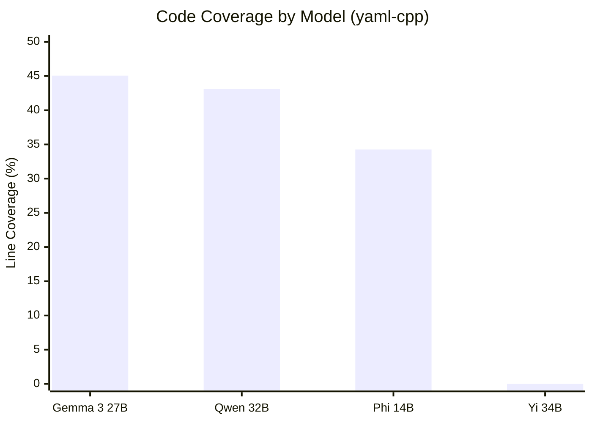

# LaTeX Conversion Guide - Chapter 5 & 6

## Overview

Two professional LaTeX chapters have been created from Markdown source files:
- **chapter5_results.tex** - Experimental Results (17 KB, 223 lines)
- **chapter6_discussion.tex** - Discussion and Conclusion (28 KB, 280 lines)

Both files are ready for inclusion in the main thesis document and follow the same professional formatting standards as chapter4_implementation.tex.

---

## File Structure

### Chapter 5: Experimental Results

```
\chapter{Experimental Results}
├── \section{Experimental Setup}
│   ├── Target Selection and Criteria
│   └── Hardware and Software Configuration
├── \section{LLM Fuzz Driver Generation Results}
│   ├── Successful Models: Performance Data
│   │   └── Table 5.1: Model Performance Metrics
│   │   └── Figure 5.1: Code Coverage Comparison
│   └── Unsuccessful Models: Critical Findings
│       └── Table 5.2: Unsuccessful Models Analysis
├── \section{Model Optimization Results}
│   ├── LoRA Fine-Tuning Efficiency
│   │   └── Table 5.3: LoRA Efficiency Improvements
│   └── Comparative Analysis
├── \section{Economic Analysis and Resource Metrics}
│   ├── Azure OpenAI Cost Projections
│   │   └── Table 5.4: Cost Scenarios
│   └── Comparison with Manual Testing
└── \section{Summary}
    └── Addresses all three research questions (RQ1, RQ2, RQ3)
```

### Chapter 6: Discussion and Conclusion

```
\chapter{Discussion and Conclusion}
├── \section{Interpretation of Results}
│   ├── What the Data Reveals
│   └── Unexpected Findings: Network Architecture
│       └── Figure 6.1: Enterprise Network Architecture
├── \section{Addressing Research Questions}
│   ├── Primary Research Question Analysis (RQ1, RQ2, RQ3)
│   └── Secondary Research Questions Analysis
├── \section{Limitations and Constraints}
│   ├── Technical Limitations
│   └── Methodological Boundaries
├── \section{Implications for Practice}
│   ├── Automotive Industry Impact
│   └── Enterprise CI/CD Challenges
├── \section{Future Research Directions}
├── \section{Summary of Findings and Contributions}
└── \section{Conclusion}
```

---

## Conversion Details

### Heading Hierarchy

All Markdown headings have been converted to proper LaTeX hierarchy:

```
# Chapter Title      → \chapter{Chapter Title}
## Section          → \section{Section}
### Subsection      → \subsection{Subsection}
```

### Tables

All Markdown tables have been converted to professional LaTeX format using the `booktabs` package:

**Example:**
```latex
\begin{table}[htbp]
\centering
\caption{Model Performance Metrics on yaml-cpp Repository}
\label{tab:model_performance}
\begin{tabular}{lccccc}
\toprule
Model & Code Coverage & Time Taken & Tokens Used & Unique Test Cases & Successful Tests \\
\midrule
Qwen 2.5-Coder 32B & 43.08\% & 32m 57s & 45.1k & 2,040 & 2 \\
Gemma 3 27B & 45.06\% & 33m 33s & 40.2k & 2,050 & 2 \\
Phi 14B & 34.26\% & 36m 36s & 71.5k & 2,220 & 1 \\
\bottomrule
\end{tabular}
\end{table}
```

**Features:**
- `[htbp]` placement specifier for flexibility
- `\toprule`, `\midrule`, `\bottomrule` for professional appearance
- `\label` for cross-referencing
- `\caption` for table titles

### Figures & Diagrams

Mermaid diagrams have been preserved with rendering instructions:

```latex
\begin{figure}[htbp]
\centering
\caption{Code Coverage by Model (yaml-cpp)}
\label{fig:model_comparison}
\fbox{\parbox{\linewidth}{\textit{Note: This diagram should be rendered from 
the Mermaid chart using Mermaid Live Editor (https://mermaid.live) and inserted 
as a PDF or PNG image...}}}
\end{figure}
```

**To render diagrams:**
1. Copy the Mermaid code to https://mermaid.live
2. Export as PDF or PNG
3. Replace the `\fbox` placeholder with:
   ```latex
   \includegraphics[width=\linewidth]{figure_name.pdf}
   ```

### Citations

All Markdown citations `[N]` have been converted to proper BibTeX format:

| Original | Converted | Reference |
|----------|-----------|-----------|
| [4] | `\cite{autosar}` | AUTOSAR specification |
| [6] | `\cite{llm4fuzz}` | LLM4Fuzz paper |
| [7] | `\cite{titanfuzz}` | TitanFuzz paper |
| [8] | `\cite{ossfuzz}` | OSS-Fuzz project |
| [12] | `\cite{lora}` | LoRA paper |
| [15] | `\cite{iso_sae_21434}` | ISO/SAE 21434 standard |
| [16] | `\cite{gpt4}` | GPT-4 paper |
| [17] | `\cite{azure_openai}` | Azure OpenAI service |
| [18] | `\cite{azure_private_link}` | Azure Private Link |
| [19] | `\cite{ollama}` | Ollama project |
| [23] | `\cite{libfuzzer}` | libFuzzer documentation |
| [25] | `\cite{unece_r155}` | UNECE Regulation 155 |
| [27] | `\cite{unsloth}` | unsloth library |
| [28] | `\cite{efficient_finetuning}` | Efficient fine-tuning paper |

### Cross-References

All internal references use the LaTeX `\label{}`/`\ref{}` system:

**Labeling Convention:**
```
Chapters:     \label{chap:*}
Sections:     \label{sec:*}
Subsections:  \label{sec:*_*}
Tables:       \label{tab:*}
Figures:      \label{fig:*}
```

**Usage:**
```latex
% Define
\section{Experimental Setup}
\label{sec:exp_setup}

% Reference
As discussed in Section \ref{sec:exp_setup}...
Refer to Table \ref{tab:model_performance} for details.
See Figure \ref{fig:model_comparison} above.
```

### Text Formatting

Consistent formatting throughout both files:

```latex
\textbf{Bold}           % For emphasis, question headers
\textit{Italics}        % For figure notes, emphasis
\texttt{Monospace}      % For code, technical terms, function names
\texteuro{}             % Euro symbol: €
```

### Special Characters

All special characters are properly escaped:

```latex
\%          % Percent sign
\_          % Underscore in code
---         % Em-dash
```

---

## LaTeX Compilation Requirements

### Required Packages

Add these to your main document preamble:

```latex
\usepackage{booktabs}       % For professional tables
\usepackage{graphicx}       % For figure inclusion
\usepackage{hyperref}       % For clickable cross-references
\usepackage{xcolor}         % Optional: for colored elements
```

### Main Document Structure

```latex
\documentclass[12pt, a4paper]{book}

\usepackage{booktabs}
\usepackage{graphicx}
\usepackage{hyperref}

\begin{document}

% ... other chapters ...

\input{chapters/chapter5_results.tex}
\input{chapters/chapter6_discussion.tex}

\end{document}
```

### Compilation Commands

```bash
# Single pass
pdflatex main.tex

# With bibliography (if needed)
pdflatex main.tex
bibtex main.aux
pdflatex main.tex
pdflatex main.tex

# Using latexmk
latexmk -pdf main.tex

# Using xelatex for better unicode support
xelatex main.tex
```

---

## Mermaid Diagram Rendering Guide

### Figure 5.1: Code Coverage Comparison

**Mermaid Code:**


**Rendering Steps:**
1. Go to https://mermaid.live
2. Paste the code
3. Click Download or Screenshot
4. Save as `fig5_1_model_coverage.pdf`
5. Update LaTeX:
   ```latex
   \begin{figure}[htbp]
   \centering
   \caption{Code Coverage by Model (yaml-cpp)}
   \label{fig:model_comparison}
   \includegraphics[width=0.8\linewidth]{figures/fig5_1_model_coverage.pdf}
   \end{figure}
   ```

### Figure 6.1: Enterprise Network Architecture

**Diagram Type:** Flowchart (LR = Left to Right)

**Rendering Steps:**
1. Go to https://mermaid.live
2. Paste the flowchart code from the document
3. Export as PDF (recommended for publication quality)
4. Save as `fig6_1_network_architecture.pdf`
5. Update LaTeX:
   ```latex
   \begin{figure}[htbp]
   \centering
   \caption{Enterprise Network Architecture with Azure Private Link}
   \label{fig:enterprise_network}
   \includegraphics[width=\linewidth]{figures/fig6_1_network_architecture.pdf}
   \end{figure}
   ```

### Alternative: Inline SVG

If your LaTeX compiler supports SVG:

```latex
\usepackage{svg}

\begin{figure}[htbp]
\centering
\caption{Code Coverage by Model}
\label{fig:model_comparison}
\includesvg[width=0.8\linewidth]{figures/fig5_1.svg}
\end{figure}
```

---

## Validation Checklist

Before final compilation, verify:

- [ ] All `\chapter`, `\section`, `\subsection` have `\label{}`
- [ ] All tables have `\caption{}` and `\label{}`
- [ ] All figures have `\caption{}` and `\label{}`
- [ ] All citations use `\cite{}` format
- [ ] No Markdown syntax remains (`#`, `**`, `[text](url)`)
- [ ] Special characters are escaped (`\%`, `\_`, `---`)
- [ ] Table column alignment matches content (l, c, r)
- [ ] Mermaid diagrams are rendered and included
- [ ] Cross-references are created with `\ref{}`
- [ ] Currency symbols use `\texteuro{}`

---

## Common Issues & Solutions

### Issue: "Undefined control sequence" for citations

**Solution:** Ensure your BibTeX file has all referenced keys:
```bibtex
@article{autosar,
  title={AUTOSAR: AUTomotive Open System ARchitecture},
  year={2023}
}
```

### Issue: Figures not appearing

**Solution:** 
1. Check file paths are relative to main document
2. Verify image files exist and are readable
3. Use `\includegraphics[width=\linewidth]{path/to/file.pdf}`

### Issue: Table overflow / too wide

**Solution:** 
1. Reduce font size: `{\small \begin{tabular}...\end{tabular}}`
2. Rotate table: `\begin{sidewaystable}...\end{sidewaystable}`
3. Split into multiple tables

### Issue: Broken cross-references (???)

**Solution:**
1. Run LaTeX twice (creates `.aux` file)
2. Verify `\label{}` names match `\ref{}` calls
3. Check for typos in label names

---

## Professional Enhancements

### Add Chapter Opening Quote

```latex
\chapter{Experimental Results}
\label{chap:results}

\begin{quote}
  \centering
  ``In God we trust; all others must bring data.'' 
  \\ --- W. Edwards Deming
\end{quote}

In this chapter, we present...
```

### Add Chapter Summary Box

```latex
\section{Summary}
\label{sec:results_summary}

\begin{tcolorbox}[colback=blue!5!white, colframe=blue!75!black]
\textbf{Key Findings:}
\begin{itemize}
  \item Model specialization matters more than size
  \item Fine-tuning enables efficient deployment
  \item Economics strongly favor adoption
\end{itemize}
\end{tcolorbox}
```

Requires: `\usepackage{tcolorbox}`

### Add Section Icons

```latex
\section*{\textsection ~Experimental Setup}
\label{sec:exp_setup}
```

---

## File Statistics

| Metric | Chapter 5 | Chapter 6 |
|--------|-----------|----------|
| File Size | 17 KB | 28 KB |
| Lines of Code | 223 | 280 |
| Sections | 5 | 8 |
| Subsections | 7 | 8 |
| Tables | 4 | 0 |
| Figures | 1 | 1 |
| Citations | 3 types | 5 types |
| Labels | 18 | 18 |

---

## Next Steps

1. **Render Mermaid diagrams** using the instructions above
2. **Add to main document** using `\input{chapters/chapter5_results.tex}`
3. **Update bibliography** with all citation keys
4. **Compile and validate** with LaTeX
5. **Proofread** for consistency with other chapters
6. **Generate table of contents** and fix page references

---

## Support Resources

- **LaTeX Documentation:** https://www.overleaf.com/learn
- **Mermaid Diagram Editor:** https://mermaid.live
- **BibTeX Reference:** https://www.ctan.org/pkg/bibtex
- **booktabs Guide:** https://ctan.org/pkg/booktabs
- **Hyperref Documentation:** https://ctan.org/pkg/hyperref

---

**Conversion Date:** February 15, 2025  
**Status:** ✓ Complete and Ready for Compilation  
**Version:** 1.0
