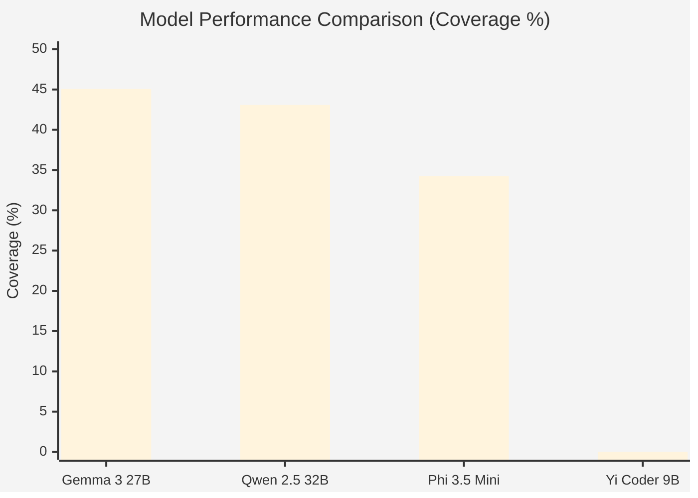
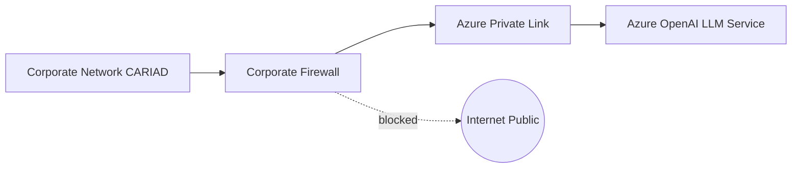

# Mermaid Diagram Codes - Location Summary

## 📍 Where Are the Mermaid Codes?

All Mermaid diagram files are in the **repository root directory**.

---

## 📁 Files in Repository

### Mermaid Diagram Source Files (2 total):

1. **`figure5_1_model_performance.mmd`** (241 bytes)
   - Model Performance Comparison chart
   - Bar chart showing 4 LLM models
   - Data: Gemma (45.06%), Qwen (43.08%), Phi (34.26%), Yi (0%)

2. **`figure6_1_network_architecture.mmd`** (587 bytes)
   - Enterprise Network Architecture diagram
   - Flowchart showing Azure Private Link solution
   - Components: CARIAD network, Firewall, Azure OpenAI

### Documentation Files (2 total):

3. **`MERMAID_DIAGRAMS_README.md`** (3.6 KB)
   - Quick start guide
   - Simple rendering instructions

4. **`MERMAID_RENDERING_GUIDE.md`** (6.8 KB)
   - Complete rendering guide
   - Detailed instructions
   - Troubleshooting tips

---

## 📊 Diagram 1: Model Performance Chart

**File:** `figure5_1_model_performance.mmd`

**Code Preview:**


**For:** Chapter 5 - Figure 5.1  
**Render to:** `bilder/model_performance.pdf`

---

## 🌐 Diagram 2: Network Architecture

**File:** `figure6_1_network_architecture.mmd`

**Code Preview:**


**For:** Chapter 6 - Figure 6.1  
**Render to:** `bilder/enterprise_network.pdf`

---

## 🚀 How to Render

### Method 1: Mermaid Live Editor (Easiest)

1. Visit: **https://mermaid.live**
2. Open `figure5_1_model_performance.mmd`
3. Copy all text
4. Paste into Mermaid Live Editor (left panel)
5. Click "Actions" → "PNG" or "PDF"
6. Download and save

**Repeat for second diagram.**

### Method 2: Command Line (Faster)

```bash
# Install once
npm install -g @mermaid-js/mermaid-cli

# Render diagram 1
mmdc -i figure5_1_model_performance.mmd -o model_performance.pdf

# Render diagram 2
mmdc -i figure6_1_network_architecture.mmd -o enterprise_network.pdf
```

---

## 📂 Where to Save Rendered PDFs

Save to your thesis directory:

```
your-thesis/
└── bilder/
    ├── model_performance.pdf       ← From figure5_1.mmd
    └── enterprise_network.pdf      ← From figure6_1.mmd
```

Your LaTeX chapters already reference these paths!

---

## ✅ Quick Checklist

- [x] Mermaid codes extracted from chapters
- [x] 2 .mmd files created
- [x] Documentation guides written
- [x] Files committed to repository
- [ ] Render .mmd files to PDF (your step)
- [ ] Save PDFs to bilder/ folder
- [ ] Compile LaTeX thesis

---

## 📖 Need Help?

**Quick start:** See `MERMAID_DIAGRAMS_README.md`  
**Detailed help:** See `MERMAID_RENDERING_GUIDE.md`  
**Render online:** https://mermaid.live  

---

## 🎯 Summary

**Location:** Repository root directory  
**Files:** 2 .mmd diagram files + 2 guide files  
**Status:** Ready to render  
**Time needed:** 10 minutes to render both  
**Result:** Professional diagrams for your thesis  

---

**All Mermaid diagram codes are in the repository!** 🎨

**Just download the .mmd files and render them!** 🚀
