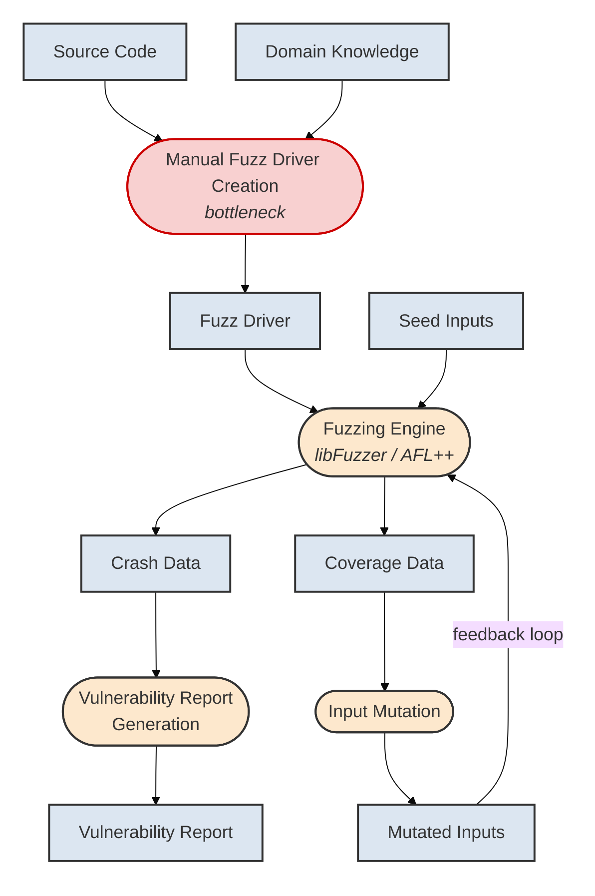
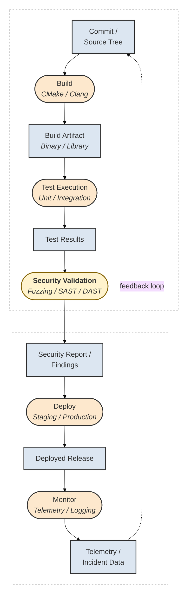
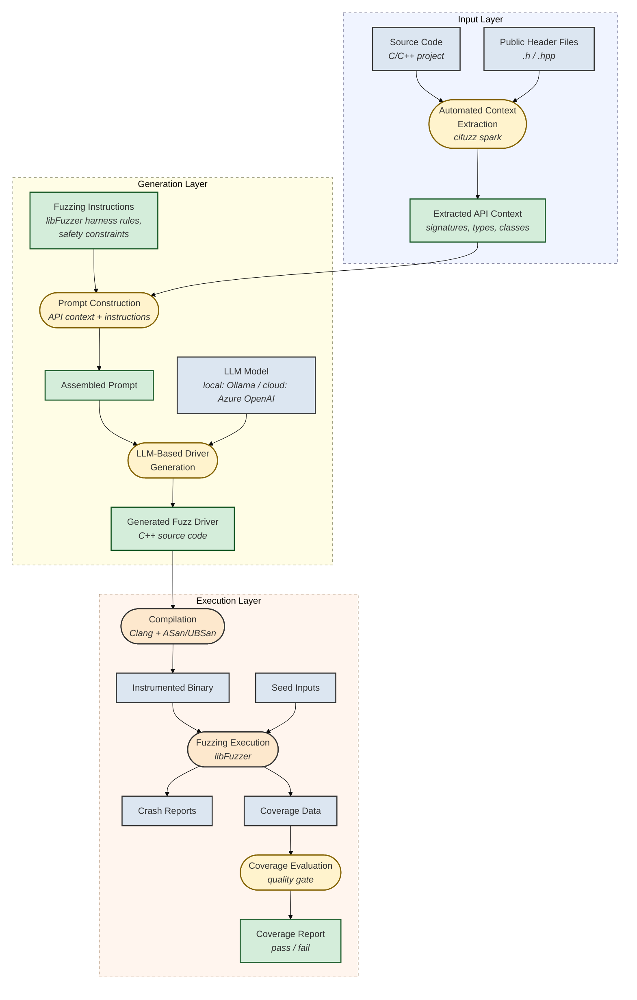
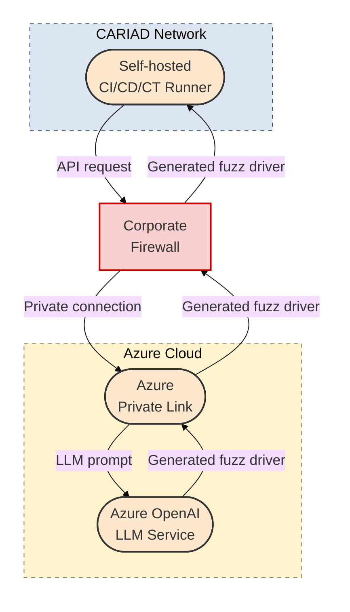
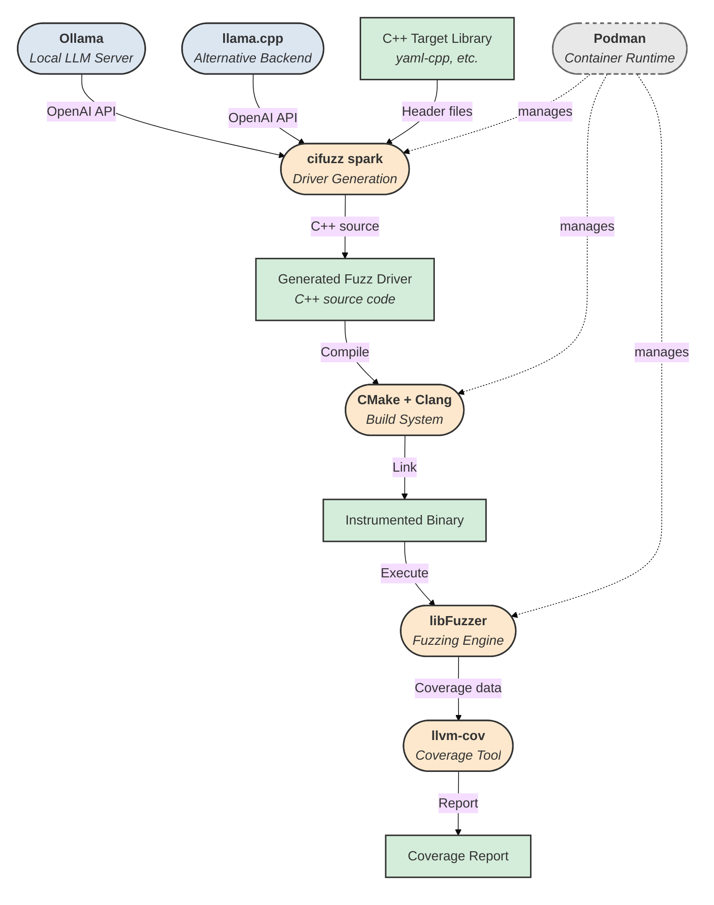
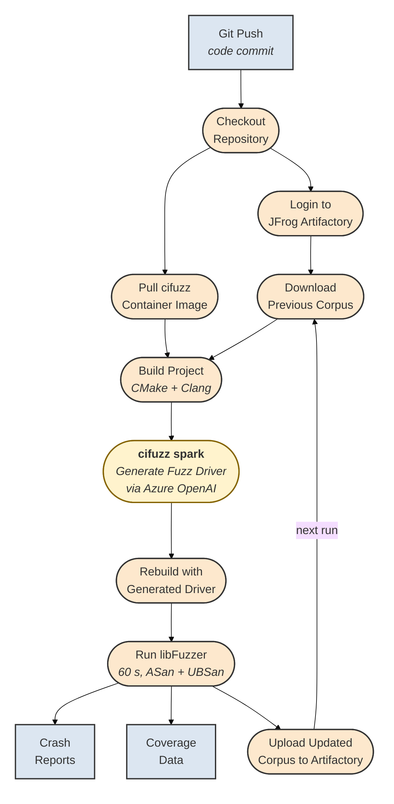
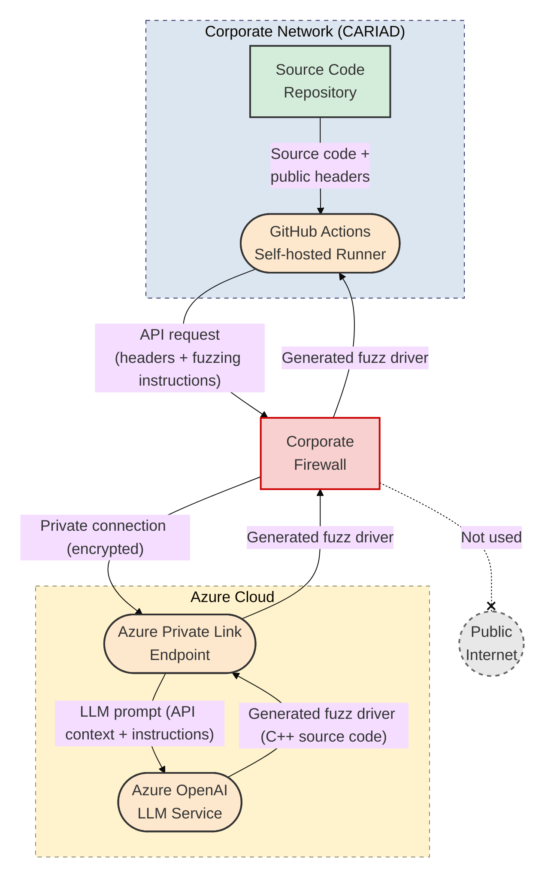
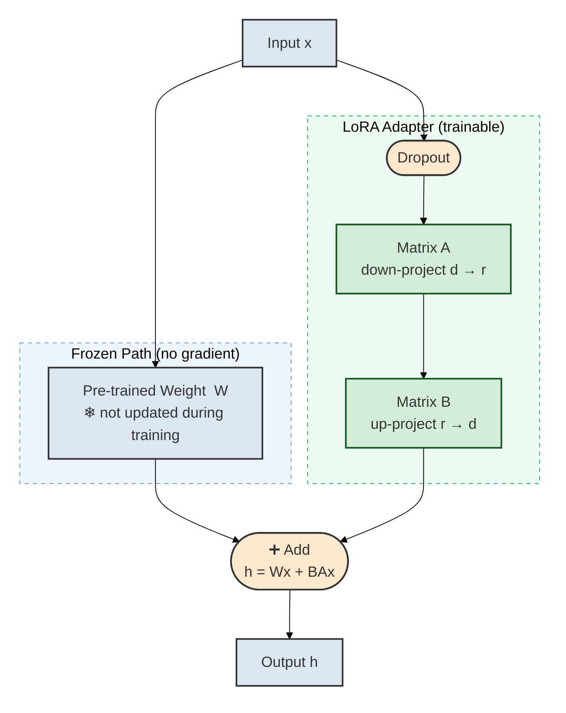

# Thesis Diagrams — Slide-Ready Mermaid Code

Paste each block into **[mermaid.live](https://mermaid.live)**, then export as **PNG at 4× scale** (≈ 3840 × 2160 px) or SVG.
In PowerPoint set the image to fill the slide (`Format Picture → Size → Height: 19.05 cm, Width: 33.87 cm` for a 16:9 slide) and send it to the back.

> **Why these layouts fit a slide:**
> Every diagram uses top-down (`TD`) flow or a two-row wrapped layout so the rendered image is roughly landscape (wider than tall), matching a 16:9 PowerPoint slide. The two previously horizontal (`LR`) diagrams — Fig 1.2 and Fig 3.2 — have been restructured into slide-friendly shapes.

---

## Figure 1.1 — The Fuzzing Process

**Caption:** The Fuzzing Process. Rectangular boxes = data artifacts; rounded boxes = processing steps. Manual fuzz-driver creation (red) is the bottleneck this thesis automates.

---

## Figure 1.2 — The Automotive CI/CD/CT Pipeline

> **Layout note:** The original single left-to-right chain was ~1900 × 100 px — too flat for a slide.
> This version wraps the pipeline into **two rows inside a top-down parent**, producing a landscape image that fills a 16:9 slide.

**Caption:** The Automotive CI/CD/CT Pipeline. Security Validation (highlighted) is where fuzzing integrates. The dashed feedback arrow from Telemetry back to the source tree represents the continuous-improvement cycle.

---

## Figure 3.1 — Technical Architecture (LLM-based Fuzz Driver Generation Pipeline)

**Caption:** Technical Architecture of the LLM-based fuzz-driver generation pipeline. Three layers with dashed borders. Blue = existing data; green = new data (our contribution); orange = existing process; yellow = new process (our contribution).

**Legend:**

| Style | Meaning |
|-------|---------|
| Blue rectangle | Existing data |
| Green rectangle | New data (our contribution) |
| Orange rounded | Existing process |
| Yellow rounded | New process (our contribution) |

---

## Figure 3.2 — Enterprise Integration Strategy

> **Layout note:** The original `flowchart LR` was ~1500 × 160 px — too flat for a slide.
> This version uses `flowchart TD` so the three zones (CARIAD → Firewall → Azure) stack vertically and the bidirectional flow reads top-to-bottom, filling the slide height.

**Caption:** Enterprise Integration Strategy. The self-hosted CI/CD/CT runner sends API requests through the corporate firewall to Azure OpenAI via Private Link — traffic never traverses the public internet.

---

## Figure 4.1 — Evaluation Environment Component Diagram

**Caption:** Evaluation Environment. Ollama or llama.cpp serve the LLM; cifuzz spark orchestrates driver generation; CMake/Clang builds; libFuzzer executes; llvm-cov measures coverage. All build and fuzzing components run inside a Podman container.

---

## Figure 4.2 — CI/CD/CT Pipeline Workflow

**Caption:** CI/CD/CT Pipeline Workflow. cifuzz spark (highlighted yellow) invokes the LLM via Azure Private Link. Corpus persistence through JFrog Artifactory enables cumulative coverage improvement across runs.

---

## Figure 6.1 — Enterprise Network Architecture with Azure Private Link

**Caption:** Enterprise Network Architecture with Azure Private Link. All edges are labeled with the data exchanged. Traffic flows through a private, encrypted connection and never traverses the public internet.

---

## Figure LoRA — How LoRA Works

**Caption:** LoRA adds a small trainable bypass path (A then B) alongside each frozen pre-trained weight W. Only the low-rank matrices A and B are updated during fine-tuning; the base model weights remain unchanged.

---

## How to Put Each Diagram on Its Own Slide

1. **Open** [mermaid.live](https://mermaid.live)
2. **Paste** the code block for the diagram you want
3. **Export → PNG** — choose **4× scale** in the export dialog (produces ≈ 3840 × 2160 px at roughly landscape aspect ratio)
4. In **PowerPoint**:
   - Insert → Pictures → pick your exported PNG
   - Right-click → **Size and Position** → set **Height = 19.05 cm** and **Width = 33.87 cm** (16:9 full-bleed), **uncheck** "Lock aspect ratio" only if needed
   - Or just drag the corners to fill the slide
5. Add a text box at the bottom for the caption if desired
6. **Repeat** for each diagram (one slide per figure)

### Color Legend (same across all diagrams)

| Box color | Shape | Meaning |
|---|---|---|
| Blue `#dce6f1` | Rectangle | Existing data artifact |
| Green `#d4edda` | Rectangle | New data (our contribution) |
| Orange `#fde8cd` | Rounded | Existing processing step |
| Yellow `#fff3cd` | Rounded | New processing step (our contribution) |
| Red `#f8d0d0` | Rounded | Bottleneck / highlighted concern |
| Grey `#e8e8e8` | Rounded / dashed | Infrastructure / container runtime |
