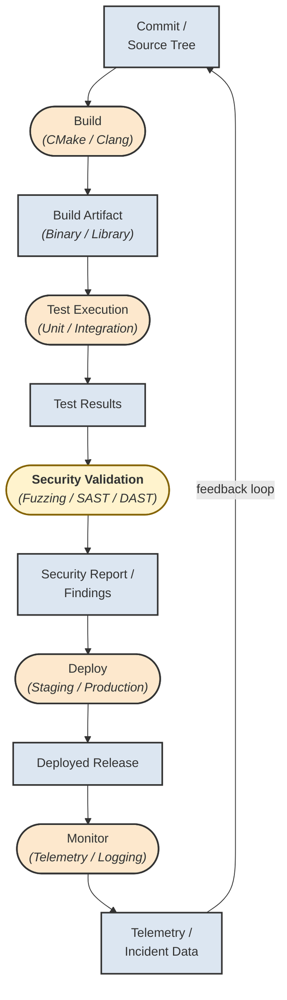
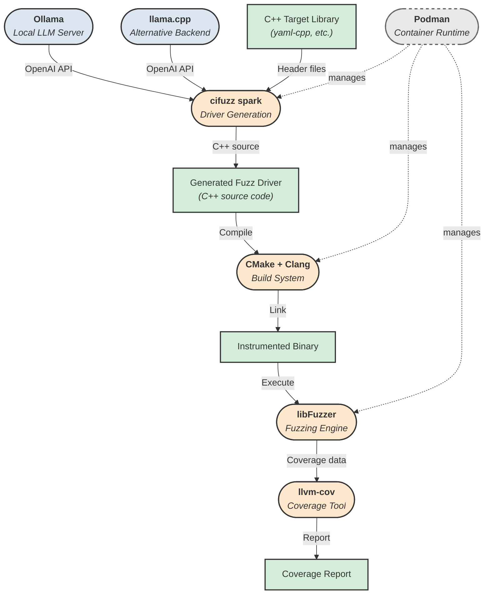
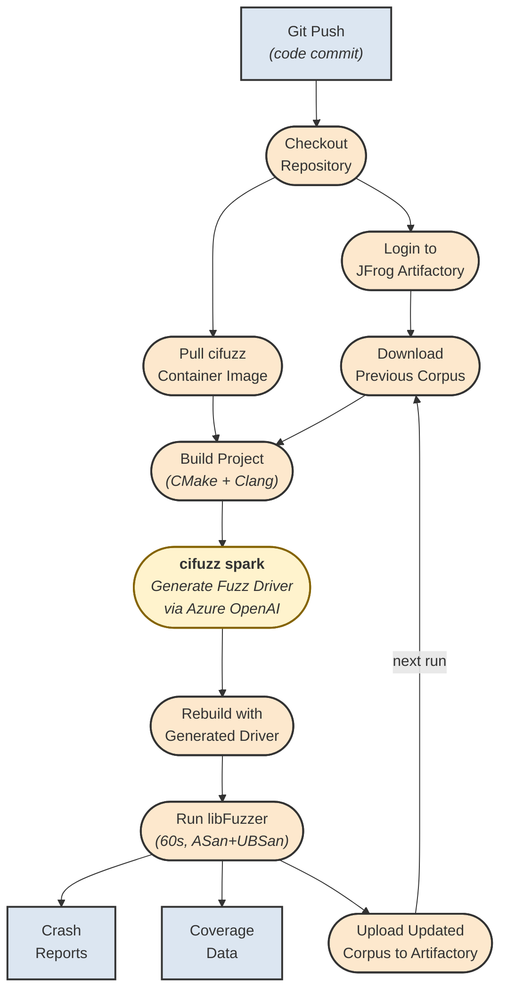
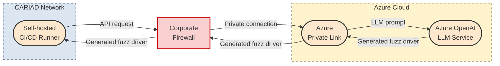
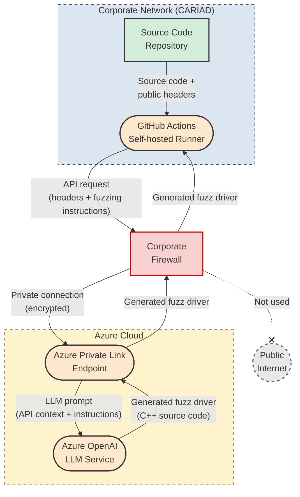

# Mermaid Diagram Alternatives

These are Mermaid versions of the thesis diagrams. You can render them at [mermaid.live](https://mermaid.live) and export as PNG/PDF, then include with `\includegraphics` in LaTeX.

**Notation used (matching the professor's requirements):**
- **Rectangular boxes** `[...]` = Data artifacts
- **Rounded boxes** `(...)` = Processing steps
- No two data boxes are directly connected
- No two processing boxes are directly connected
- Top-down (TD) layout for maximum size

---

## Figure 1.1 — The Fuzzing Process


**Caption:** The Fuzzing Process. Data artifacts are shown in rectangular boxes; processing steps are shown in rounded boxes. The manual creation of fuzz drivers (highlighted in red) is the bottleneck this thesis aims to automate.

---

## Figure 1.2 — The Automotive CI/CD Pipeline



**Caption:** The Automotive CI/CD Pipeline. Data artifacts are shown in rectangular boxes; processing steps are shown in rounded boxes. Security validation (highlighted) is where fuzzing integrates into the pipeline. The feedback loop from telemetry to the source tree represents the continuous improvement cycle.

**How to use:** Export as PNG from [mermaid.live](https://mermaid.live) and replace the TikZ block at `chapters/introduction.tex` lines 103–158 with:
```latex
\begin{figure}[htbp]
    \centering
    \includegraphics[width=\textwidth]{bilder/cicd_pipeline_mermaid.png}
    \caption{The Automotive CI/CD Pipeline. Data artifacts are shown in rectangular boxes; processing steps are shown in rounded boxes. Security validation (highlighted) is where fuzzing integrates into the pipeline. The feedback loop from telemetry to the source tree represents the continuous improvement cycle.}
    \label{fig:cicd_pipeline}
\end{figure}
```

---

## Figure 3.1 — Technical Architecture (LLM-based Fuzz Driver Generation Pipeline)


**Caption:** Technical Architecture of our LLM-based fuzz driver generation pipeline. The three layers are marked with dashed borders. Data artifacts are shown in rectangular boxes; processing steps in boxes with rounded corners. Green/yellow highlighted elements denote new contributions of this work with respect to the state of the art (cf. Figure 1.2).

**Legend:**
| Style | Meaning |
|-------|---------|
| Blue rectangle | Existing data |
| Green rectangle | New data (our contribution) |
| Orange rounded | Existing process |
| Yellow rounded | New process (our contribution) |

---

## How to Use These Mermaid Diagrams

### Option A: Render online and export (RECOMMENDED)
1. Go to [mermaid.live](https://mermaid.live)
2. Paste the Mermaid code for the diagram you want
3. Export as **PNG** (choose high resolution, e.g., 4x) or **SVG**
4. Save the exported file to the `bilder/` folder
5. Replace the TikZ code in the `.tex` file with `\includegraphics` (see exact instructions below)

### Option B: Use the `mermaid-filter` for Pandoc
If you convert through Pandoc, install `mermaid-filter` and it auto-renders.

### Option C: Keep using the TikZ versions already in the .tex files
The TikZ versions are already embedded in the LaTeX files and compile directly. They use the same notation (rectangular = data, rounded = process) and follow the top-down layout. **No action needed.**

---

## Exact Lines to Change to Switch from TikZ to Mermaid

### Figure 1.1 (Fuzzing Process) — in `chapters/introduction.tex`

**What to do:** Export the Mermaid diagram above as `bilder/fuzzing_mermaid.png`, then replace lines 33–87 of `chapters/introduction.tex`.

**Replace this entire TikZ block (lines 33–88):**
```latex
\begin{figure}[htbp]
    \centering
    \resizebox{\textwidth}{!}{
    \begin{tikzpicture}[
        ...entire TikZ code...
    \end{tikzpicture}
    }
    \caption{The Fuzzing Process...}
    \label{fig:fuzzing_concept}
\end{figure}
```

**With this:**
```latex
\begin{figure}[htbp]
    \centering
    \includegraphics[width=\textwidth]{bilder/fuzzing_mermaid.png}
    \caption{The Fuzzing Process. Data artifacts are shown in rectangular boxes; processing steps are shown in rounded boxes. The manual creation of fuzz drivers (highlighted in red) is the bottleneck this thesis aims to automate.}
    \label{fig:fuzzing_concept}
\end{figure}
```

### Figure 3.1 (Technical Architecture) — in `chapters/methodology.tex`

**What to do:** Export the Mermaid diagram above as `bilder/architecture_mermaid.png`, then replace lines 34–135 of `chapters/methodology.tex`.

**Replace this entire TikZ block (lines 34–135):**
```latex
\begin{figure}[htbp]
    \centering
    \resizebox{\textwidth}{!}{
    \begin{tikzpicture}[
        ...entire TikZ code...
    \end{tikzpicture}
    }
    \caption{Technical Architecture of our LLM-based...}
    \label{fig:tech_architecture}
\end{figure}
```

**With this:**
```latex
\begin{figure}[htbp]
    \centering
    \includegraphics[width=\textwidth]{bilder/architecture_mermaid.png}
    \caption{Technical Architecture of our LLM-based fuzz driver generation pipeline. The three layers are marked with dashed borders. Data artifacts are shown in rectangular boxes; processing steps in boxes with rounded corners. Green/yellow highlighted elements denote new contributions of this work with respect to the state of the art (cf.\ Figure~\ref{fig:fuzzing_concept}).}
    \label{fig:tech_architecture}
\end{figure}
```

---

## Figure 4.1 — Evaluation Environment Component Diagram



**Caption:** Evaluation Environment Component Diagram. Components (rounded boxes) interact via defined interfaces. Ollama or llama.cpp serve the LLM; cifuzz spark orchestrates driver generation; CMake/Clang builds the driver; libFuzzer executes it; llvm-cov measures coverage. All build and fuzzing components run inside a Podman container. The top-down flow shows the data transformation pipeline from source code to coverage report.

**How to use:** Export as PNG from [mermaid.live](https://mermaid.live) and replace the TikZ block at `chapters/implementation.tex` lines 193–256 with:
```latex
\begin{figure}[htbp]
    \centering
    \includegraphics[width=\textwidth]{bilder/eval_environment_mermaid.png}
    \caption{Evaluation Environment Component Diagram. Components (rounded boxes) interact via defined interfaces. Ollama or llama.cpp serve the LLM; cifuzz spark orchestrates driver generation; CMake/Clang builds the driver; libFuzzer executes it; llvm-cov measures coverage. All build and fuzzing components run inside a Podman container.}
    \label{fig:eval_environment}
\end{figure}
```

---

## Figure 4.2 — CI/CD Pipeline Workflow Diagram



**Caption:** CI/CD Pipeline Workflow. Processing steps are in rounded boxes; data artifacts in rectangular boxes. The highlighted step (cifuzz spark) invokes the LLM via Azure Private Link. Corpus persistence through JFrog Artifactory enables cumulative coverage improvement across runs.

**How to use:** Export as PNG from [mermaid.live](https://mermaid.live) and replace the TikZ block at `chapters/implementation.tex` lines 458–519 with:
```latex
\begin{figure}[htbp]
    \centering
    \includegraphics[width=\textwidth]{bilder/cicd_workflow_mermaid.png}
    \caption{CI/CD Pipeline Workflow. Processing steps are in rounded boxes; data artifacts in rectangular boxes. The highlighted step (cifuzz spark) invokes the LLM via Azure Private Link. Corpus persistence through JFrog Artifactory enables cumulative coverage improvement across runs.}
    \label{fig:cicd_workflow}
\end{figure}
```

---

## Figure 3.2 — Enterprise Integration Strategy



**Caption:** Enterprise Integration Strategy. The self-hosted CI/CD runner communicates with Azure OpenAI through a Private Link endpoint, routing traffic through the corporate firewall over a private connection without traversing the public internet.

**How to use:** Export as PNG from [mermaid.live](https://mermaid.live) and replace the TikZ block at `chapters/methodology.tex` lines 180–213 with:
```latex
\begin{figure}[htbp]
    \centering
    \includegraphics[width=\textwidth]{bilder/integration_mermaid.png}
    \caption{Enterprise Integration Strategy. The self-hosted CI/CD runner communicates with Azure OpenAI through a Private Link endpoint, routing traffic through the corporate firewall over a private connection without traversing the public internet.}
    \label{fig:enterprise_integration}
\end{figure}
```

---

## Figure 6.1 — Enterprise Network Architecture with Azure Private Link



**Caption:** Enterprise Network Architecture with Azure Private Link. All edges are labeled with the data exchanged between components. Traffic flows through a private connection and never traverses the public internet.

**How to use:** Export as PNG from [mermaid.live](https://mermaid.live) and replace the TikZ block at `chapters/discussion_conclusion.tex` lines 47–95 with:
```latex
\begin{figure}[htbp]
    \centering
    \includegraphics[width=\textwidth]{bilder/network_architecture_mermaid.png}
    \caption{Enterprise Network Architecture with Azure Private Link. Processing components are shown in rounded boxes; data stores in rectangular boxes. All edges are labeled with the data exchanged between components. Traffic flows through a private connection and never traverses the public internet.}
    \label{fig:enterprise_network}
\end{figure}
```

---

## Complete Diagram Inventory

| # | Figure | File | TikZ | Mermaid | Notation |
|---|--------|------|------|---------|----------|
| 1 | Fig 1.1 — Fuzzing Process | introduction.tex | ✅ | ✅ | data=rect, process=rounded, top-down |
| 2 | Fig 1.2 — Automotive CI/CD Pipeline | introduction.tex | ✅ | ✅ | data=rect, process=rounded, top-down |
| 3 | Fig 3.1 — Technical Architecture | methodology.tex | ✅ | ✅ | data=rect, process=rounded, top-down, layers marked |
| 4 | Fig 3.2 — Enterprise Integration | methodology.tex | ✅ | ✅ | components=rounded, data=rect, left-right |
| 5 | Fig 4.1 — Eval Environment | implementation.tex | ✅ | ✅ | components=rounded, data=rect, top-down |
| 6 | Fig 4.2 — CI/CD Workflow | implementation.tex | ✅ | ✅ | data=rect, process=rounded, top-down |
| 7 | Fig 6.1 — Network Architecture | discussion_conclusion.tex | ✅ | ✅ | components=rounded, data=rect, top-down, edges labeled |

All diagrams use the same notation:
- **Rectangular boxes** = Data artifacts / data stores
- **Rounded boxes** = Processing steps / components
- No two data boxes directly connected (mediated by a process)
- No two process boxes directly connected (mediated by data)
- Top-down layout where possible for maximum size

### Important Notes
- Keep the `\caption` and `\label` exactly as shown — other parts of the thesis reference these labels
- Make sure the PNG is high resolution (at least 300 DPI or use the 4x export option in mermaid.live)
- The SVG format also works if you use `\usepackage{svg}` in thesis.tex (add before `\begin{document}`)
