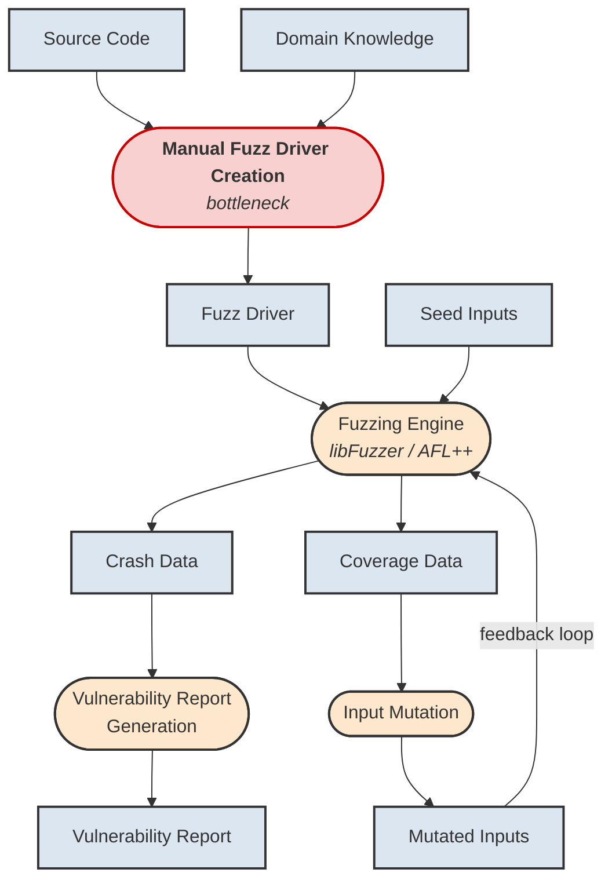
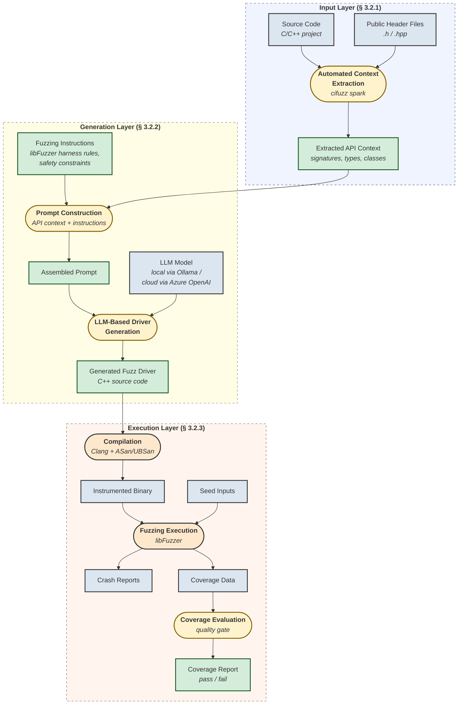

# Mermaid Diagram Alternatives

These are Mermaid versions of the thesis diagrams. You can render them at [mermaid.live](https://mermaid.live) and export as PNG/PDF, then include with `\includegraphics` in LaTeX.

**Notation used (matching the professor's requirements):**
- **Rectangular boxes** `[...]` = Data artifacts
- **Rounded boxes** `(...)` = Processing steps
- No two data boxes are directly connected
- No two processing boxes are directly connected
- Top-down (TD) layout for maximum size

---

## Figure 1.2 — The Fuzzing Process

**Caption:** The Fuzzing Process. Data artifacts are shown in rectangular boxes; processing steps are shown in rounded boxes. The manual creation of fuzz drivers (highlighted in red) is the bottleneck this thesis aims to automate.

---

## Figure 3.1 — Technical Architecture (LLM-based Fuzz Driver Generation Pipeline)

**Caption:** Technical Architecture of our LLM-based fuzz driver generation pipeline. The three layers are marked with dashed borders. Data artifacts are shown in rectangular boxes; processing steps in boxes with rounded corners. Green/yellow highlighted elements denote new contributions of this work with respect to the state of the art (cf. Figure 1.2).

**Legend:**
| Style | Meaning |
|-------|---------|
| Blue rectangle | Existing data |
| Green rectangle | New data (our contribution) |
| Orange rounded | Existing process |
| Yellow rounded | New process (our contribution) |

---

## How to Use These Mermaid Diagrams

### Option A: Render online and export
1. Go to [mermaid.live](https://mermaid.live)
2. Paste the Mermaid code
3. Export as PNG (high resolution) or SVG
4. Save to `bilder/` folder
5. In LaTeX: `\includegraphics[width=\textwidth]{bilder/fuzzing_mermaid.png}`

### Option B: Use the `mermaid-filter` for Pandoc
If you convert through Pandoc, install `mermaid-filter` and it auto-renders.

### Option C: Keep using the TikZ versions already in the .tex files
The TikZ versions are already embedded in the LaTeX files and compile directly. They use the same notation (rectangular = data, rounded = process) and follow the top-down layout.
